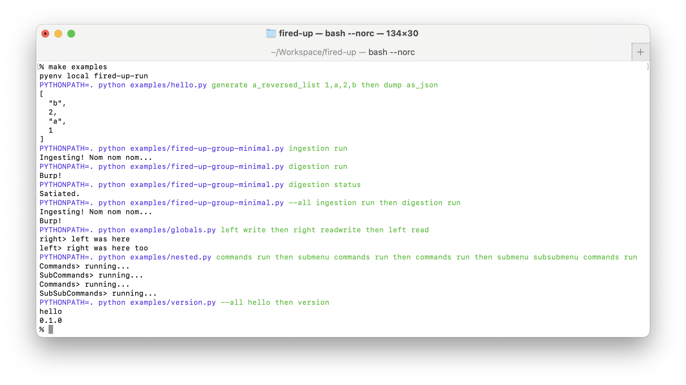

# Examples & More

Besides the `then` sequencer, `FiredUp` offers some more support to allow grouped command classes to interact:

## Globals and Arguments

Besides the clipboard to pass around information, you can also use globals and pass arguments to the constructors of the Groups:

```python
from fired_up import FiredUp, Group

class Left(Group):
  def __init__(self, write, *args, **kwargs):
    super().__init__(*args, **kwargs)
    self._write = write

  def write(self):
    if self._write:
      self._globals["message"] = "left was here"

  def read(self):
    print("left>", self._globals["message"])

class Right(Group):
  def readwrite(self):
    print("right>", self._globals["message"])
    self._globals["message"] = "right was here too"

FiredUp(left=(Left, { "write" : True }), right=Right)
```

```console
% python examples/globals.py left write then right readwrite then left read
right> left was here
left> right was here too
```

## Menus

The FireUp class is kind of a Menu of Groups of Commands. You cal also nest Menus of your own:

```python
import json

from fired_up import FiredUp, Menu, Group

class Commands(Group):
  def run(self):
    print("Commands> running...")

class SubCommands(Group):
  def run(self):
    print("SubCommands> running...")

class SubSubCommands(Group):
  def run(self):
    print("SubSubCommands> running...")

FiredUp(
  commands=Commands,
  submenu=Menu(
    commands=SubCommands,
    subsubmenu=Menu(
      commands=SubSubCommands
    )
  )
)
```

```console
% python examples/nested.py commands run then submenu commands run then commands run then submenu subsubmenu commands run
Commands> running...
SubCommands> running...
Commands> running...
SubSubCommands> running...
```

## Simple Commands

Besides objects with commands and menus, you can also simply provide a function, which will be handled as a command:

```python
from fired_up import FiredUp, __version__

def get_hello():
  return "hello"

def get_version():
  return __version__
  
FiredUp(hello=get_hello, version=get_version)
```

```console
% python examples/version.py --all hello then version
hello
0.0.7
```

## Public Functions and Output

Since `FiredUp` makes all public functions chainable, public functions that return some value can't be used directly by other functions. To access the original return value one can use `.paste()` in a chaining way:

```python
from fired_up import FiredUp, Group

class Test(Group):
  def public1(self):
    return "abc"                  # return value is "copied", self is returned

  def public2(self):
    print(self.public1().paste()) # returns the return value of public

  def public3(self):
    return self.public1()         # returns self, which is "pasted" as last result

FiredUp(test=Test)
```

```console
% python examples/public.py test public1
abc
% python examples/public.py test public2
abc
% python examples/public.py test public3
NAME
    public.py test public3

SYNOPSIS
    public.py test public3 GROUP | COMMAND

GROUPS
    GROUP is one of the following:

     globals

COMMANDS
    COMMAND is one of the following:

     copy

     paste

     public1

     public2

     public3

     then
```

## The examples/ Folder and Target

You can run all examples in one go, using the `Makefile`'s `examples` target:


